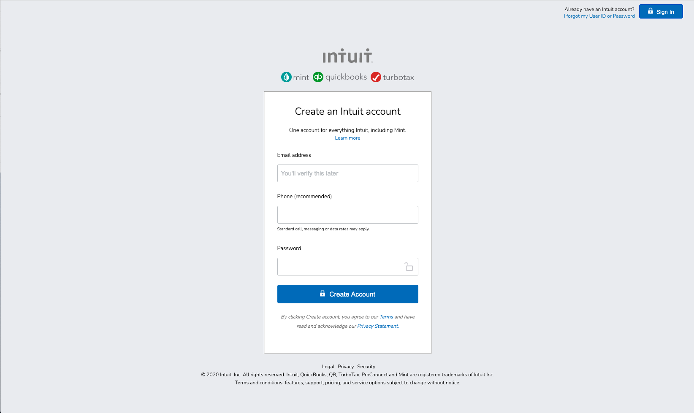

# Mint.com-clone

<!-- ABOUT THE PROJECT -->

## About The Project

In this project, I cloned the form used by Mint.com for signing up new users. The page is very straightforward, I used form, label, and input tags and make them the proper size and alignment.
 
 

### Built With

- [HTML]
- [CSS]
- [JAVASCRIPT]

<!-- LICENSE -->

## License

Distributed under the MIT License. See `LICENSE` for more information.
